# Uni Estates Tracker — Mapa procesów

## Jak czytać ten dokument
Każdy proces opisany jest w trzech częściach:
1. **Kto** — kto uczestniczy w procesie
2. **Diagram** — wizualny przepływ kroków
3. **Opis kroków** — co dokładnie dzieje się w każdym kroku

---

## PROCES 1 — Logowanie do aplikacji

**Kto:** każdy użytkownik (agent, manager, superadmin)

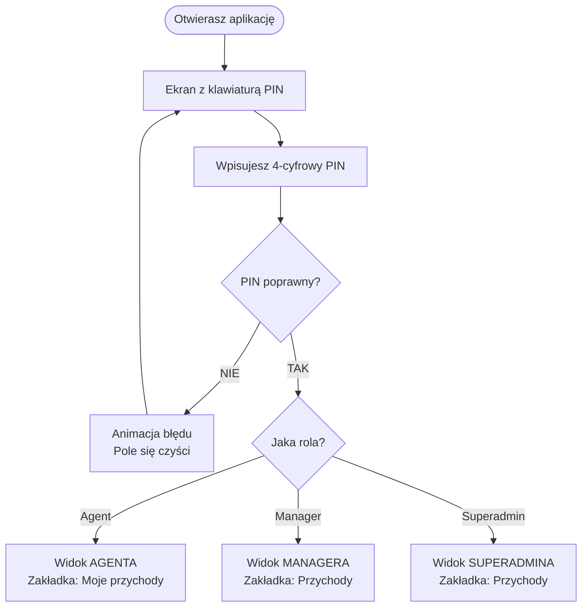

**PINy:**
| Kto | PIN | Co widzi po zalogowaniu |
|-----|-----|------------------------|
| Piotr Chrobak (Superadmin) | `1234` | Wszystkie oddziały |
| Zbigniew Michalak (Superadmin) | `2234` | Wszystkie oddziały |
| Katarzyna Trybala (Manager Katowice) | `3234` | Tylko Katowice |
| Hanna (Agent Warszawa) | `1001` | Tylko swoje dane |
| Michał (Agent Warszawa) | `1002` | Tylko swoje dane |
| Nikolay (Agent Warszawa) | `1003` | Tylko swoje dane |
| Grzegorz (Agent Warszawa) | `1004` | Tylko swoje dane |
| Piotr Z. (Agent Warszawa) | `1005` | Tylko swoje dane |
| Mikołaj (Agent Warszawa) | `1006` | Tylko swoje dane |

---

## PROCES 2 — Agent wpisuje swoje działania (codziennie)

**Kto:** agent  
**Kiedy:** codziennie lub raz w tygodniu  
**Gdzie:** zakładka **Wpis**

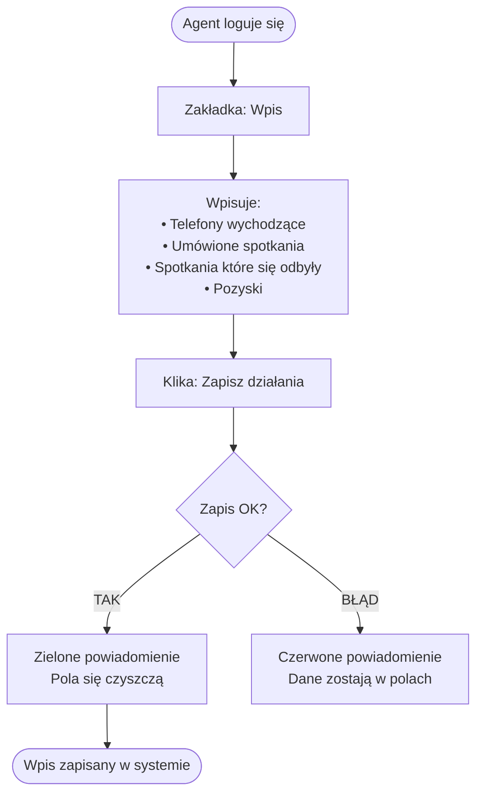

**Co dzieje się z danymi po zapisie:**
- Wpis trafia do bazy danych przypisany do **bieżącego tygodnia** i **bieżącego kwartału**
- Dane natychmiast widoczne w zakładkach: **Moje wyniki**, **Ranking**, **Aktywność** (u managera)
- Jeśli agent wpisuje kilka razy w tygodniu — sumowane są wszystkie wpisy

---

## PROCES 3 — Agent sprawdza swoje wyniki

**Kto:** agent  
**Gdzie:** zakładki **Moje przychody** i **Wyniki**

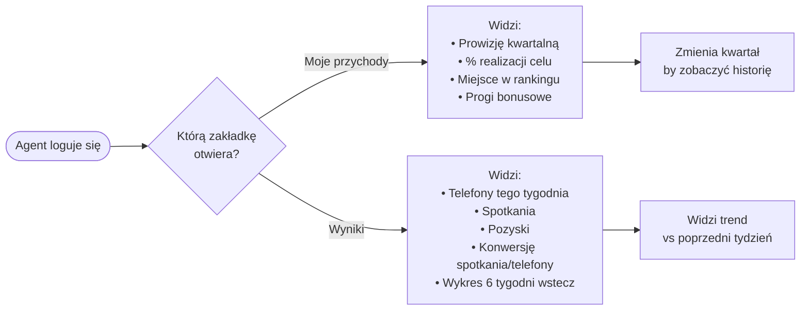

**Skąd biorą się dane o przychodach:**
- Na razie: dane wpisywane ręcznie przez managera
- Docelowo: automatycznie z arkusza Google Sheets agenta (`Plik Prowizje-Bonusy`)

**Progi bonusowe** — pokazują 3 poziomy prowizji:
- Próg 1: niższy procent prowizji (np. 3%)
- Próg 2: wyższy procent (np. 5%)
- Próg 3: najwyższy procent (np. 7%)
- Docelowo: wartości z arkusza **WARUNKI BONUSÓW**

---

## PROCES 4 — Agent obsługuje zapytania

**Kto:** agent  
**Gdzie:** zakładka **Zapytania**  
**Źródło danych:** arkusz Google Sheets agenta (zakładka `Zapytania`)

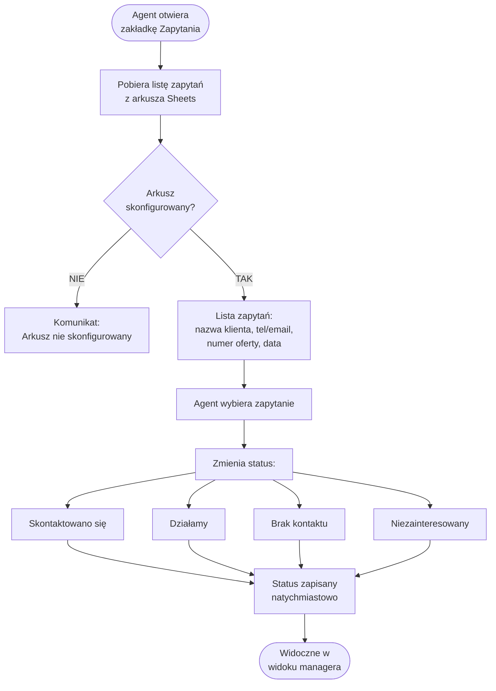

**Ważne zasady:**
- Dane klientów (imię, telefon, e-mail) przechowywane są **wyłącznie w arkuszu Sheets**
- W bazie danych zapisywany jest tylko **status** (co zrobiono z zapytaniem)
- Agent może odświeżyć listę pociągając ekran w dół (pull-to-refresh)

---

## PROCES 5 — Agent obsługuje leady

**Kto:** agent  
**Gdzie:** zakładka **Leady**  
**Źródło danych:** arkusz Google Sheets agenta (zakładka `Leady`)

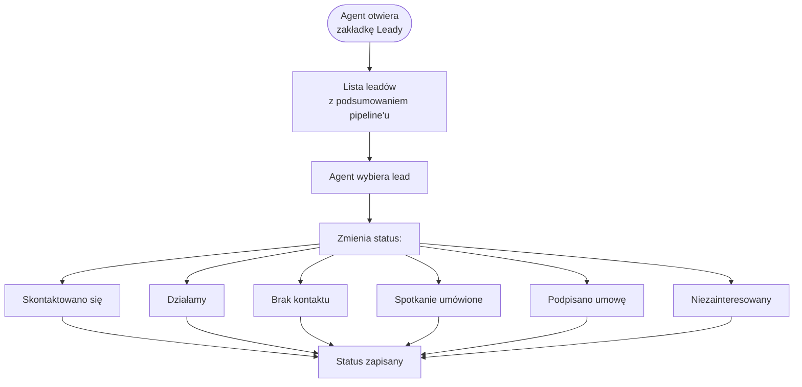

**Pipeline u góry ekranu** pokazuje ile leadów jest na każdym etapie — agent ma natychmiastowy przegląd swojego lejka sprzedażowego.

---

## PROCES 6 — Manager przegląda przychody oddziału

**Kto:** manager  
**Gdzie:** zakładka **Przychody**

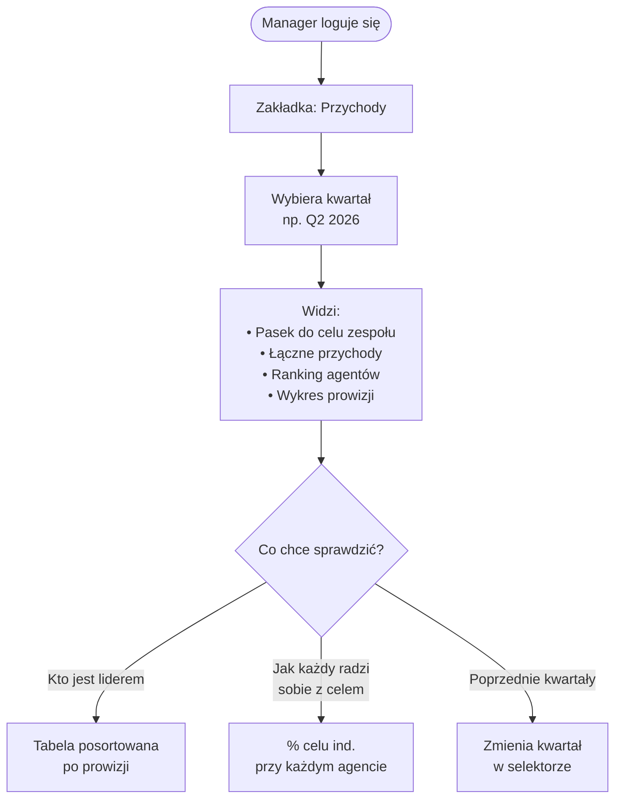

**Statusy agentów w tabeli:**
- **Cel!** (zielony) — prowizja ≥ 100% celu indywidualnego
- **Na kursie** (niebieski) — 70–99% celu
- **W toku** (złoty) — 40–69% celu
- **Niski** (czerwony) — poniżej 40% celu

---

## PROCES 7 — Manager ocenia agentów

**Kto:** manager  
**Gdzie:** zakładka **Oceny**  
**Kiedy:** raz w tygodniu (np. w piątek lub poniedziałek)

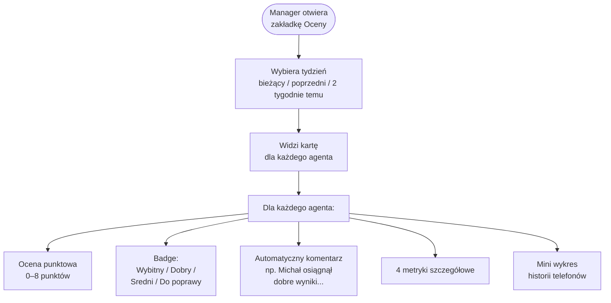

**Jak system wylicza ocenę:**
```
Telefony ≥ 50/tydzień       → +2 pkt
Telefony ≥ 25/tydzień       → +1 pkt
Pozyski ≥ 3 w tygodniu      → +3 pkt
Pozyski ≥ 1 w tygodniu      → +2 pkt
Konwersja ≥ 5%              → +2 pkt   (spotkania ÷ telefony)
Konwersja ≥ 2%              → +1 pkt
Wzrost telefonów > 10% r/r  → +1 pkt
─────────────────────────────────────
Maksymalnie                    8 pkt
```

---

## PROCES 8 — Manager wpisuje aktywność za agenta

**Kto:** manager lub superadmin  
**Gdzie:** zakładka **Wpis**  
**Kiedy:** gdy agent sam nie wpisał lub potrzeba korekty

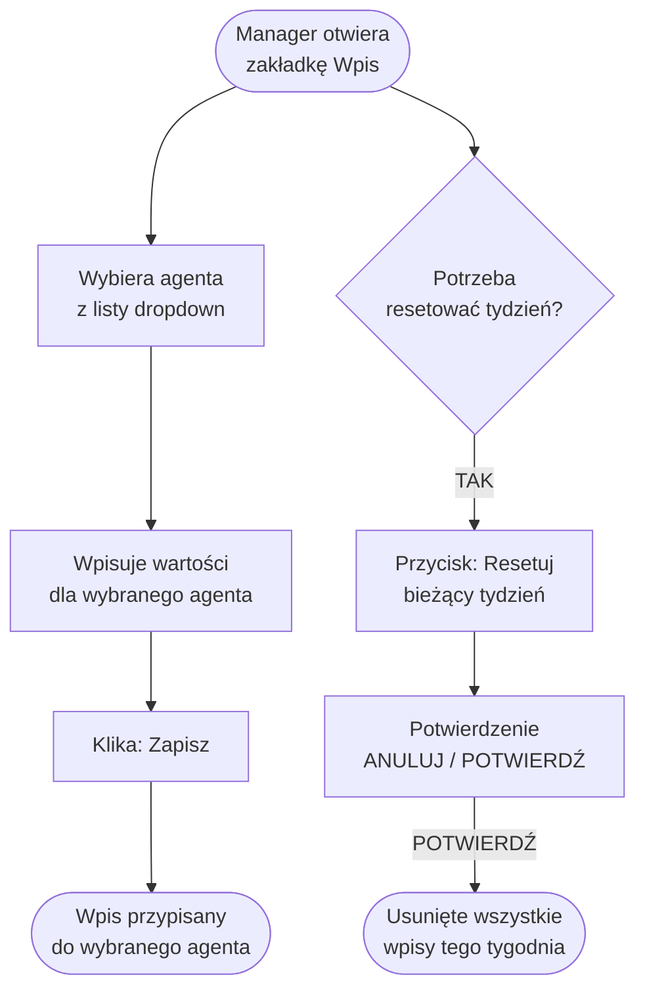

---

## PROCES 9 — Manager przegląda zapytania i leady zespołu

**Kto:** manager lub superadmin  
**Gdzie:** zakładki **Zapytania** i **Leady**

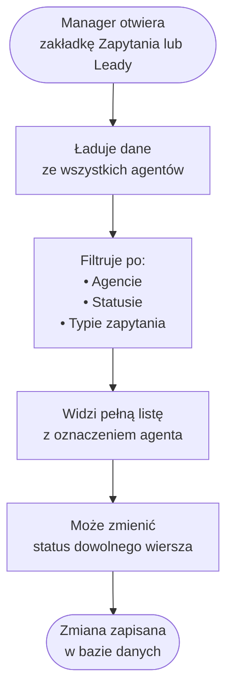

---

## PROCES 10 — Superadmin przegląda wszystkie oddziały

**Kto:** superadmin (Piotr Chrobak lub Zbigniew Michalak)  
**Gdzie:** zakładka **Przychody**

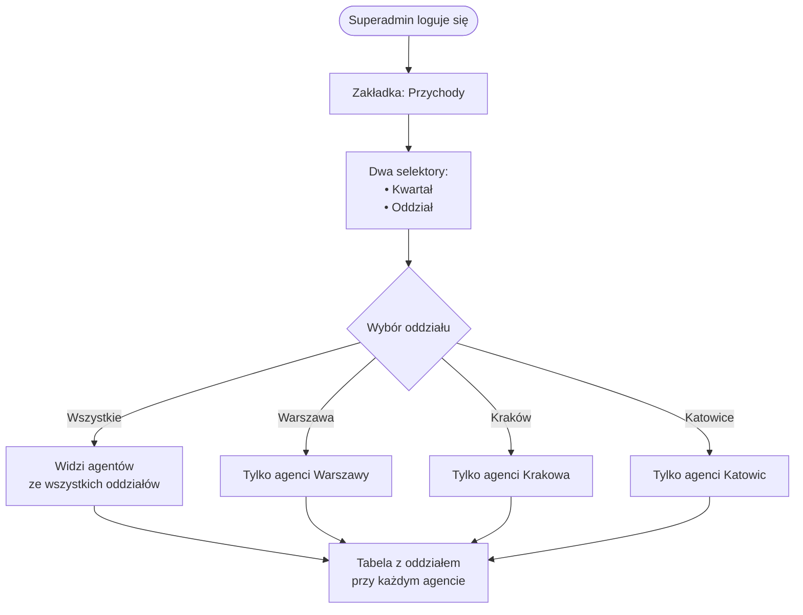

---

## PROCES 11 — Synchronizacja danych z Google Sheets

**Kto:** automatyczny (przy starcie serwera) lub ręcznie przez superadmina  
**Kiedy:** przy każdym uruchomieniu serwera

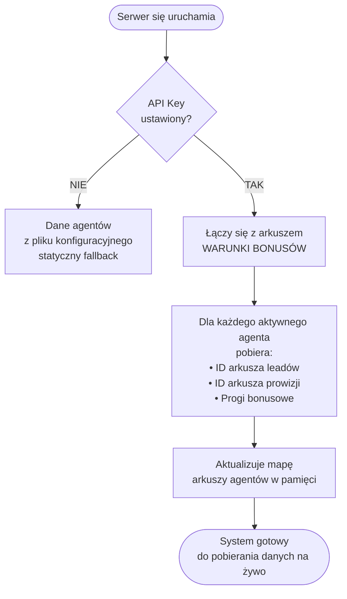

**Skąd biorą się dane w poszczególnych zakładkach:**

| Zakładka | Źródło danych | Cache |
|----------|---------------|-------|
| Przychody (manager/superadmin) | Baza danych SQLite | — |
| Moje przychody (agent) | Baza danych SQLite (docelowo: Sheets) | — |
| Aktywność | Baza danych SQLite | — |
| Oceny | Baza danych SQLite | — |
| Wpis | → zapisuje do bazy SQLite | — |
| Moje zapytania | Google Sheets agenta + statusy z DB | 5 min |
| Moje leady | Google Sheets agenta + statusy z DB | 5 min |
| Zapytania (manager) | Google Sheets wszystkich agentów + DB | 5 min |
| Leady (manager) | Google Sheets wszystkich agentów + DB | 5 min |

---

## MAPA UPRAWNIEŃ — co kto może

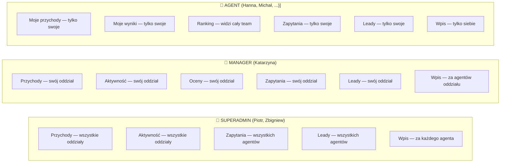

---

## HARMONOGRAM TYPOWEGO TYGODNIA

```mermaid
gantt
    title Tydzień pracy z aplikacją
    dateFormat  D
    axisFormat  %A

    section Agent (codziennie)
    Wpis działań dziennych        :active, 1, 5d

    section Agent (piątek)
    Sprawdzenie rankingu          :4, 1d
    Przegląd zapytań i leadów     :4, 1d

    section Manager (poniedziałek)
    Przegląd aktywności zespołu   :1, 1d
    Oceny agentów za miniony tydz.:1, 1d

    section Manager (w ciągu tygodnia)
    Przeglądanie leadów i zapytań :1, 5d
    Wpis za agentów jeśli brakuje :2, 3d

    section Manager (koniec kwartału)
    Aktualizacja przychodów       :5, 1d
```

---

*Dokument przeznaczony dla właścicieli procesów biznesowych. Wersja: 2026-04-29*
